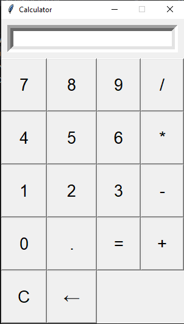

# Calculator Project

This is a simple calculator application with a graphical user interface (GUI) built using Python and Tkinter. It allows basic mathematical operations such as addition, subtraction, multiplication, and division.

## Features

- **Basic operations**: Addition, subtraction, multiplication, division
- **GUI**: A simple and user-friendly interface built using Tkinter
- **Gradient background**: A visually appealing gradient background from orange to blue

## Screenshot



## Requirements

- Python 3.x
- Tkinter (comes pre-installed with Python in most distributions)

## Installation

1. Clone this repository:

    ```bash
    git clone https://github.com/Freky96/Calculator.git
    ```

2. Navigate into the project directory:

    ```bash
    cd Calculator
    ```

3. Run the application:

    ```bash
    python calculator_gui.py
    ```

## License

This project is licensed under the MIT License - see the [LICENSE](LICENSE) file for details.

## Contributing

Feel free to fork this project, open issues, and submit pull requests. Contributions are welcome!
